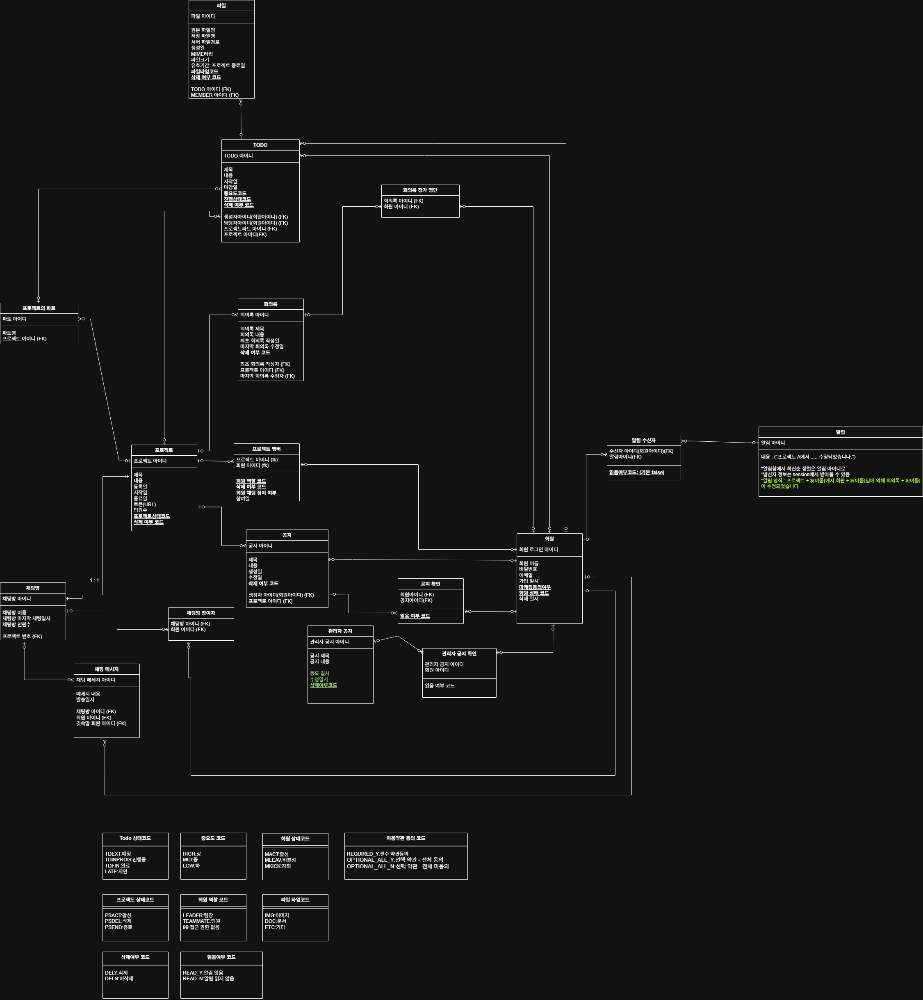
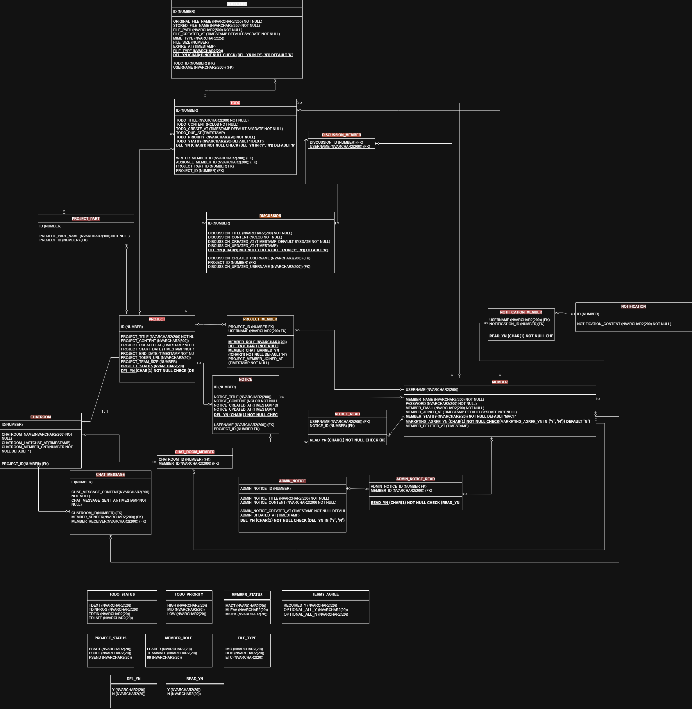
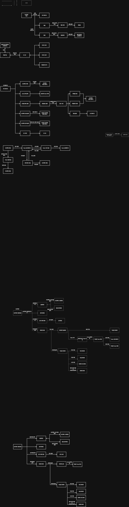

# 🌊 FlowMate

> **일정 관리, 소통, 협업을 하나로** — 기존 협업툴의 단점을 보완한 통합 프로젝트 관리 플랫폼

<br>

## 📌 프로젝트 소개

기존 협업툴은 다음과 같은 한계가 있었습니다.

- **높은 커스터마이징 비용**: 원하는 워크플로우를 구성하기까지 많은 시간과 노력이 필요
- **문서 관리 부재**: 일정/태스크 관리에 특화된 나머지 문서 관리 기능이 부족
- **높은 진입장벽**: 처음 사용하는 사용자가 적응하기 어려운 복잡한 UI/UX

FlowMate는 이러한 문제를 해결하기 위해, **일정 관리 · 소통 · 협업** 기능을 하나의 플랫폼으로 통합하여 누구나 쉽게 팀 프로젝트를 관리할 수 있도록 만들었습니다.

<br>

## 🛠 기술 스택

### Frontend


### Backend


### Database & Infra


<br>

## ✨ 주요 기능

### 👤 회원 관리

- 회원가입 / 로그인 / 로그아웃
- 아이디 · 비밀번호 찾기 및 계정 복구
- 이메일 · 비밀번호 변경
- 마이페이지 (프로필 정보 관리)
- 계정 탈퇴

### 📁 프로젝트 관리

- 프로젝트 생성 · 수정 · 삭제
- 초대코드를 통한 프로젝트 참여
- 프로젝트 멤버 관리 (팀장 / 팀원 역할 구분)
- 프로젝트 설정 및 정보 변경

### ✅ TODO (할 일 관리)

- TODO 생성 · 수정 · 삭제 · 상세 조회
- 마감일 설정 및 D-day 알림 (D-3, D-1, D-day)
- 파일 첨부 기능 (최대 5개 / 개당 10MB / 총 50MB)
- 담당자 지정

### 📋 회의록 (Discussion)

- 회의록 생성 · 수정 · 삭제 · 상세 조회
- 이전 · 다음 회의록 네비게이션

### 📢 공지사항 (Notice)

- 프로젝트 공지사항 등록 · 조회
- 관리자 공지사항 관리 (Admin)

### 💬 실시간 채팅

- Socket.io 기반 실시간 채팅
- 채팅방 생성 및 멤버 초대
- 팀장의 멤버 채팅금지(Ban) 기능
- 반응형 UI (1024px 이하 비활성화)

### 🔔 알림

- WebSocket(STOMP) 기반 실시간 알림
- TODO 마감 D-day 알림
- 프로젝트 관련 알림 목록 조회

### 🛡 관리자 (Admin)

- 전체 회원 및 프로젝트 관리
- 서비스 공지사항 작성 · 수정 · 삭제
- 스케줄러를 통한 자동화 작업 관리

<br>

## 🚀 실행 방법

### 배포 사이트

🔗 [https://flowmate.moonjunghoon991124.workers.dev/](https://flowmate.moonjunghoon991124.workers.dev/)

### 로컬 실행

**Frontend**

```bash
cd flowmate_frontend/frontend
npm install
npm run dev
```

```bash (other terminal)
cd flowmate_frontend/server
npm install
npm run dev
```

**Backend**

```bash
# application.properties에 DB 및 환경변수 설정 필요
./gradlew bootRun
```

**환경변수 설정 (.env)**

```env (frontend)
VITE_API_URL=your_api_url
VITE_WS_URL=your_websocket_url
VITE_WEBSOCKET_URL=your_websocket_url
```

```env (server)
VITE_API_URL=your_api_url
VITE_WS_URL=your_websocket_url
SPRING_API_URL=your_api_url
```

<br>

## 🏗 아키텍처

### ERD




### 플로우차트



<br>

## 🔥 트러블슈팅

### 1.

**문제**:

**원인**:

**해결**:

---

### 2.

**문제**: 로컬 환경에서는 잘되던 이메일 전송과 이메일 인증 기능이 배포 환경에서는 되지 않은 문제가 발생했다.

**원인**: 
1. 이메일 인증 : 로컬에선 redis가 로컬서버로도 돌아갔지만 배포서버에서는 로컬호스트 서버를 사용 할 수 없어서 오류 발생

2. 이메일 전송 : redis를 외부 서버로 돌렸으나 스팸 방지를 위해 자기 자신에게만 메일을 전송할 수 있음

**해결**: 
1. 이메일 인증 : upstash 사이트를 이용한 외부 서버에 redis 값을 저장

2. 이메일 전송 : upstah 서버에서 메일 포트를 막고 있기때문에 사용하지 못하는걸 알았습니다. 이를 해결하기 위해 도메인을 이용해 문제 해결

---

### 3. 배포환경에서 파일 저장 기능 동작 불가

**문제**: 로컬 환경에서는 서버에 직접 파일을 저장하는 방식으로 정상 동작했지만, 배포 환경에서는 서버에 직접 파일을 저장할 수 없어 파일 첨부 기능 자체가 동작하지 않았습니다.

**원인**: 배포 환경은 로컬과 달리 서버 파일 시스템에 직접 접근하는 방식을 사용할 수 없었습니다.

**해결**: Cloudinary 외부 클라우드 스토리지를 도입하여 파일을 업로드하도록 변경했습니다. 또한 Todo나 파일 삭제 시 Cloudinary에서도 함께 삭제 처리가 되도록 연동을 구현하여 데이터 일관성을 유지했습니다.

<br>

### 4. Discussion에서 Todo 할당 권한 문제

**문제**: 회의록에서 Todo를 생성할 때, 팀원이 다른 참여자에게 Todo를 할당하지 못하는 현상 발생

**원인**: 기존 `TodoService.createTodo()`의 권한 검증 로직이 그대로 적용되어 팀원은 자신에게만 Todo를 할당할 수 있었음. 그러나 회의록의 특성상 작성자의 역할에 관계없이 회의 참여자 누구에게나 할당할 수 있어야 했음

**해결**: Discussion 전용 `createDiscussionTodo()` 메서드를 별도로 구현하여 할당 조건을 "같은 프로젝트 참여자"로 완화. 기존 Todo 로직의 일관성을 유지하면서 Discussion 요구사항을 충족하는 설계 적용

---

### 5. 채팅방 생성 시 Hibernate flush 순서 오류

**문제**: 채팅방 생성 시 `ChatRoomMember` insert 전에 중복 체크 select가 먼저 실행되며 오류 발생

**원인**: `ChatRoom` 엔티티의 `@OneToOne(unique = true)` 설정으로 인해 Hibernate batch 처리 시 flush 타이밍이 꼬여 `ChatRoom` insert 전에 `ChatRoomMember` 중복 체크가 먼저 실행됨

**해결**: `@OneToOne`에서 `unique` 속성을 제거하고 DB 레벨에서만 unique 제약을 관리. `createChatRoom()`에 `entityManager.flush()`를 명시적으로 추가하여 insert 순서 보장

<br>

## 👥 팀원 소개

| 이름   | 역할 | 담당 기능                  |
| ------ | ---- | -------------------------- |
| 김예지 | 팀장 | 공지사항, 마이페이지       |
| 김아인 | 팀원 | UI/UX, 관리자 페이지       |
| 김예현 | 팀원 | 회의록, 채팅방             |
| 김태형 | 팀원 | 프로젝트 페이지            |
| 문정훈 | 팀원 | 회원관리, 테이블관리, 배포 |
| 유주하 | 팀원 | 알림                       |
| 장원준 | 팀원 | Todo                       |
